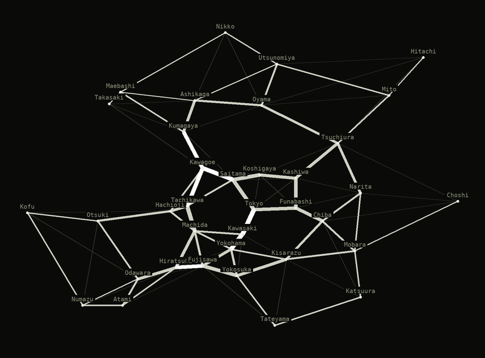
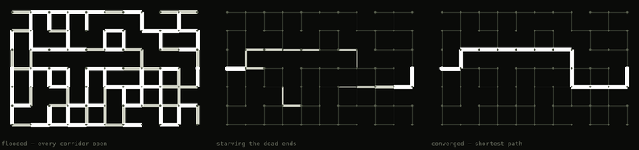

# Physarum

A model of the slime mold *Physarum polycephalum* — an organism without a single
neuron that finds shortest paths and designs transport networks.



*Thirty-six cities, no map of Japan, no mention of Tokyo anywhere in the code.
Food is placed on every city, two are picked at random each step, and a tube
thickens in proportion to the flow it carried. What survives are the corridors
the real railway was built along.*

The whole organism fits in two equations:

```
Q_ij = D_ij * (p_i - p_j) / L_ij        flux through a tube
dD_ij/dt = f(|Q_ij|) - D_ij             tube adaptation
f(Q) = Q^g / (1 + Q^g)
```

A tube that carries flow thickens. A tube that doesn't, dies. There is nothing
else in it.

Model: Tero A. et al., "Rules for Biologically Inspired Adaptive Network Design",
*Science* 327:439 (2010), DOI 10.1126/science.1177894.

## Running it

```bash
npm install
npm run dev      # opens at http://localhost:5173
npm test         # checks the core, needs no dependencies
npm run build
```

`npm test` requires Node 22.6 or newer — the tests run straight from `.ts`
through `--experimental-strip-types`, with no build step.

On Windows PowerShell may block `npm` under its execution policy. Use
`npm.cmd install`, `npm.cmd run dev` and so on.

## What's in here

```
src/core/graph.ts     graph structures, maze generator
src/core/solver.ts    the model itself, about 120 lines
src/core/dijkstra.ts  ordinary shortest path — used only as a control
src/core/render.ts    canvas rendering
src/core/pools.ts     pool graph: edge length equals swap cost
src/data/kanto.ts     coordinates of cities around Tokyo
src/SimCanvas.tsx     the canvas component that runs a solver instance
src/Site.tsx          the page
test/                 two suites of checks
```

## The page

Everything runs client-side. Nothing is precomputed, fetched or replayed.

**Live panel.** Food on all 36 Kanto cities, a random source-sink pair every
step, the network settling into shape. This is the Science 2010 setup.

**Maze.** Nature 2000: in a maze with food at both ends the mold withdraws from
the dead ends and keeps the shortest path. Dijkstra's result on the same graph is
shown next to it — the numbers have to match.

**Pools.** The same solver on a graph of liquidity pools: nodes are tokens, edge
length is the cost of a swap (fee plus slippage), so the shortest path is the
cheapest route.

**What is real, and what is not.** Two columns, stated before anyone asks.

## Two things implementations get wrong

**Fix the current, not the pressure.** If you pin the pressures at both ends, the
total flux decays together with the conductivities and the whole network quietly
fades to zero. With a fixed current `I0` at the source, the flux along the
surviving path stays near `I0` and the system reaches equilibrium.

**In network mode the survival threshold has to be absolute.** When food sits in
many nodes, a tube to a distant city only carries flow in a small fraction of the
sampled pairs, so its equilibrium thickness is inherently small — and a relative
threshold ("a fraction of the thickest") cuts it along with the dead ones. Dead
tubes decay to `dMin` and separate from the living ones by an order of magnitude,
so that mode is passed `{ absolute: 0.01 }`.

One more: with a single pair per step, peripheral tubes die off between visits.
That is what `pairsPerStep` is for — it averages several pairs per step, making
adaptation slower than the pair sampling, and the network stays connected.

## Checks



The same solver in a maze, left to right: every corridor open, the dead ends
starving, one tube left. That last frame is checked against Dijkstra on the same
graph — the two lengths have to agree, and twenty random mazes are checked on
every run.

```
npm test
```

`test/solver.test.ts` — twenty random 11×7 mazes. In each one the surviving
network is compared against Dijkstra on the same graph. 20 of 20 match.

`test/network.test.ts` — network mode: the network over 36 Kanto cities has to be
connected, cover every city, and have a cost (total length divided by the minimum
spanning tree) in a sensible range. It comes out at 2.04 — the paper's authors got
1.75 against 1.80 for the actual Tokyo railway. Plus pool routing, and the mold
checked against Dijkstra on that same graph.

## What is real and what is not

Real:

- the equations and parameters are from the 2010 paper, unmodified;
- convergence on the shortest path is proven: Bonifaci, Mehlhorn, Varma (2012);
- the match with Dijkstra is checked by a test, not asserted;
- the city coordinates are the real coordinates of Kanto cities.

Not real:

- this is a mathematical model, not a living cell. There is no live slime mold in
  this project;
- the model has no notion of a token, a price or a wallet. It minimises path
  length on a graph;
- the Tokyo screen poses the same problem, but on a different point set and on a
  nearest-neighbour graph rather than a continuous substrate. It is not a
  reproduction of the experiment;
- the 1.75 against 1.80 figures are the authors' result, not our measurement;
- the pool data in this repository is an example, not real pools.

## Plugging in real data

`src/core/pools.ts` expects an array of `Pool`:

```ts
interface Pool {
  tokenA: string;
  tokenB: string;
  feeBps: number;        // 30 = 0.3%
  liquidityUsd: number;
}
```

Slippage is estimated as `S / L` for a constant-product pool — a rough figure for
ranking routes, not a quote. Before any real swap the route must be re-checked
against the pool's own quoter.

## References

- Nakagaki T., Yamada H., Tóth Á. "Maze-solving by an amoeboid organism". *Nature* 407:470 (2000)
- Tero A. et al. "Rules for Biologically Inspired Adaptive Network Design". *Science* 327:439 (2010)
- Bonifaci V., Mehlhorn K., Varma G. "Physarum can compute shortest paths" (2012)

## License

MIT.
